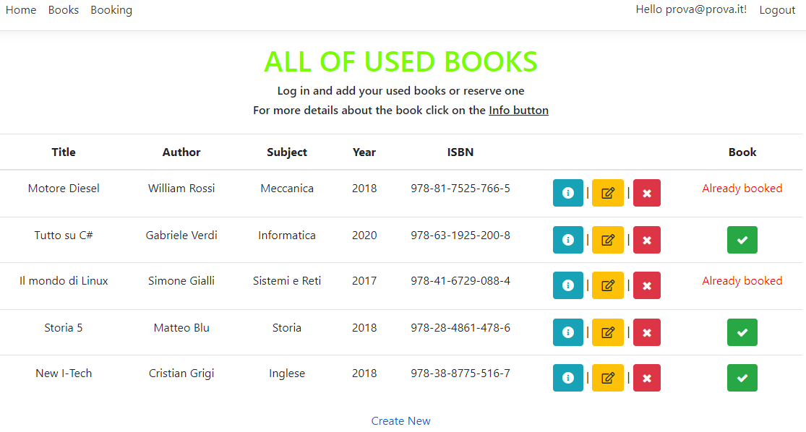
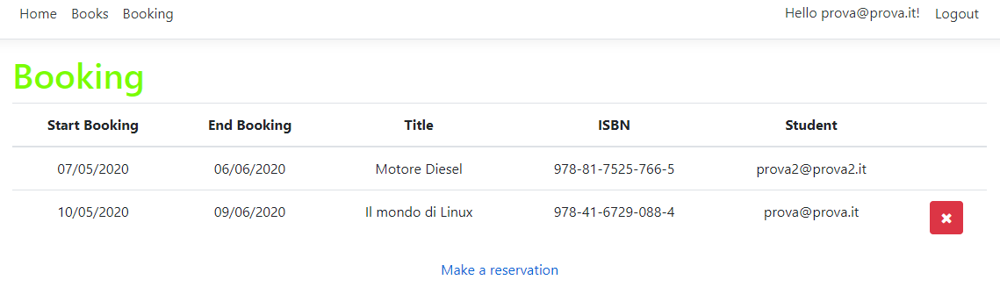
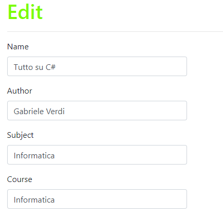
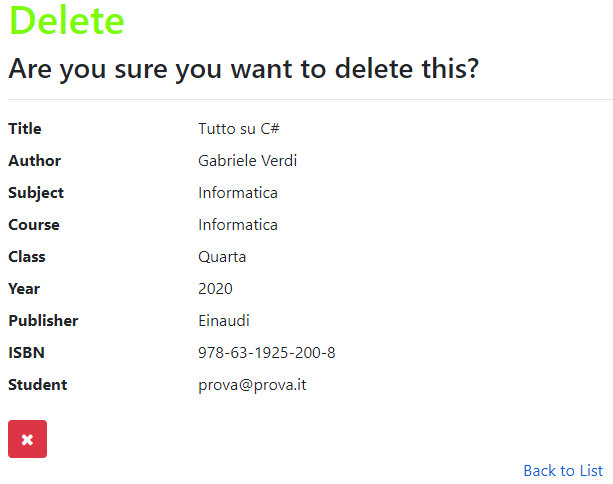
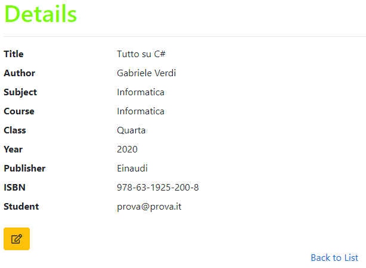

# UsedBooks
An ASP.NET Core project that manages a database of used books and gives the opportunity to make reservations.

Everyone can *add*, *update* and *delete* only their **own books**.

*The **Index** page of the **books** section.* 

You can also make a reservation and delete it (if it's yours).

*The **Index** page of the **booking** section.* 

*The **Edit** page of the books list.* 

*The **Delete** page of the books list.* 

*The **Details** page of the books list.* 

It includes also Identity.
